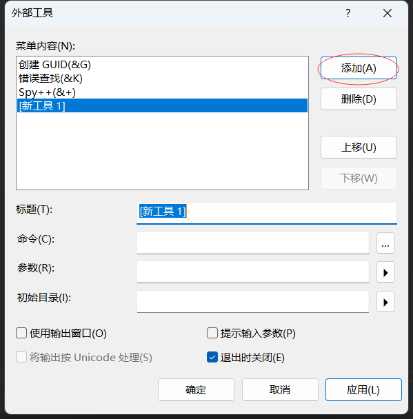

## 关于忽略配置

忽略配置在项目开发期间非常重要，能够避免在提交和合并中非必要的冲突，并且大量的编译过程文件会消耗远程仓库的磁盘，也会影响clone或pull的效率，所以编写`.gitignore`需要认真对待。

第三方忽略配置参考链接：https://github.com/github/gitignore

## 编码规范参考链接

Java：

- https://github.com/alibaba/p3c
-  IDEA插件安装参考：https://github.com/alibaba/p3c/tree/master/idea-plugin

前端：

- 阿里：https://github.com/alibaba/f2e-spec

- 腾讯：https://tgideas.qq.com/doc/frontend/
- 京东：https://guide.aotu.io/index.html
- 百度：https://github.com/ecomfe/spec

谷歌风格指南：

- https://github.com/zh-google-styleguide/zh-google-styleguide

## `Cpplint`安装教程

### 1 安装Python

注意：当前目录给出的`cpplint.py`脚本仅支持的`Python2`，所以需要安装`Python2`。

在Git使用分享直播中提供的安装包中已经给出了Python安装包，使用它安装即可。


安装过程基本上一路默认就行了，安装位置（**注意：不要安装在中文路径下面**）自行选择即可，下面是我安装好后的文件路径。


### 2 安装`cpplint`

只需要将当前目录下面的`cpplint.py`下载到Python安装目录Tools/Scripts目录，如下图所示。


### 3 集成到VS中

打开VS，按照下图方式显示出VS工具栏。


依次打开菜单，工具->外部工具->添加。




输入工具相关参数


参数示例如下：

```powershell
"D:\software\Python27\Tools\Scripts\cpplint.py" --output=vs7 --filter=-readability/utf8,-build,-whitespace $(ItemPath)
```

> 其他参数说明：
>
> [--verbose=#]：指定输出错误级别，值为数字[1,5]
>
> [--output=vs7]：输出格式，有emacs和vs7两种, 默认是emacs，vs7是Visual Studio输出的兼容格式
>
> [--filter=-x,+y,...]：指定输出错误类型，-表示不输出，+表示输出（错误类型可以查看脚本中的_ERROR_CATEGORIES定义的对应的列表）
>
> [--counting=total|toplevel|detailed]：输出错误总数的方式，默认为total
>
> [--linelength=digits]：控制每行的最长长度，google cpplint默认是80字符

**其他参考：**

- https://github.com/cpplint/cpplint
- https://cloud.tencent.com/developer/article/1494003

### 4 编码检查测试

在VS中打开一个项目（**注意：你的项目不能处于中文路径中，否则Cpplint将会报错**）。

然后打开你要检查的代码文件，然后依次点击菜单，工具->Cpplint，如下图所示。


观察检查结果


文件头部加入如下注释即可解决问题

